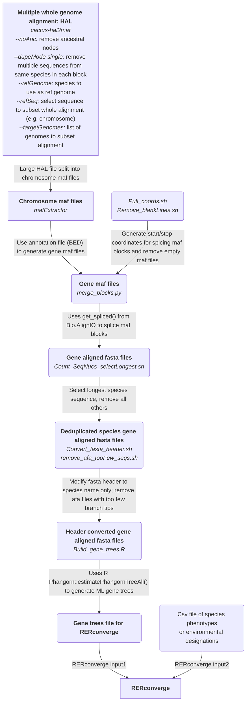

# RERconverge_pipeline
Pre-processing steps (and relative evolutionary rate and enrichment analysis) from Cactus mammalian  [whole genome alignment](https://zoonomiaproject.org/the-data/) (Genereux, et al. 2020) (HAL file) to gene trees for RERconverge analyses (Kowalczyk et al. 2019). 

## Overview

